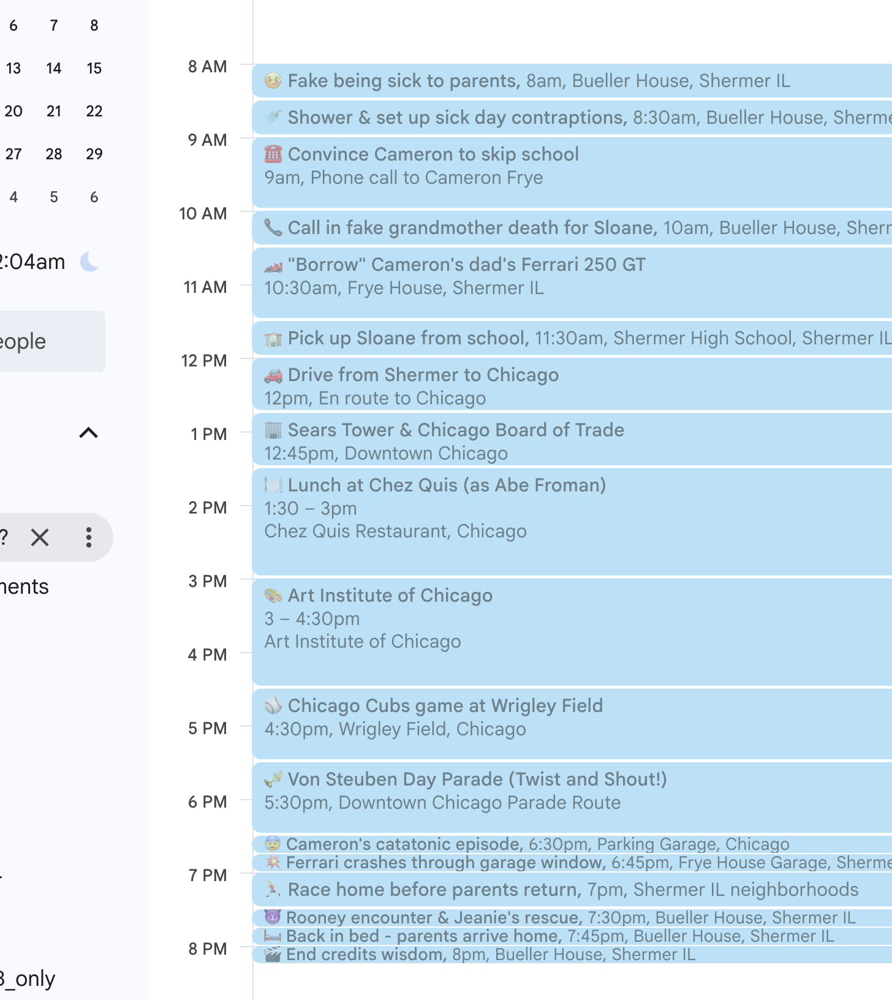
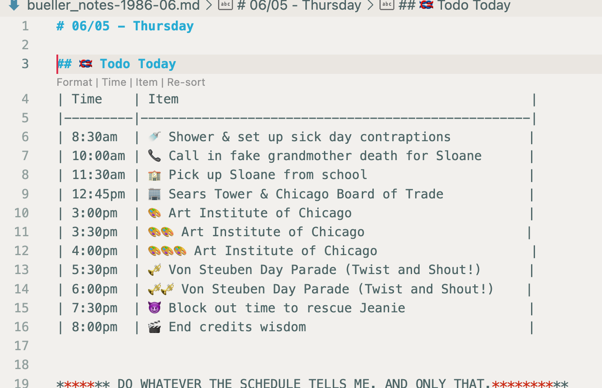

🌞 Why did we build `gday`?
=============================

My calendar is a canonical source of truth for commitments of my time. But I live and breathe markdown. I wanted to sit down in the morning, type a few chars into my terminal, and get my day started. That's `gday`.

🌞🌞 Who's it for?
=============================

Me!

But maybe you too if you're brain is similarly shaped: terminal-first developers, productivity enthusiasts, and anyone who manages multiple Google Calendars while preferring command-line interfaces over GUI applications. Perfect for those who live and breathe markdown.


🌞🌞🌞 What does it do?
=============================

It turns today's gCal appointments into a markdown table, in pomodoro-sized chunks.

- _Extract_ the day's schedule from Google Calendar,
- _Transform_ it into a markdown table, in pomodoro-sized chunks,
- _Load_ it into my daily journal (along w/ a few custom prompts)


| Go from this (Google Calendar)...                    | ...to this (gday output)                                  |
|------------------------------------------------------|-----------------------------------------------------------|
|  |  |


🌞🌞🌞🌞 How do I use it?
=============================

- set it up (below)
- Each morning, type `gday` when you sit down at yr desk
- paste into yr Obsidian or Roam or whatever daily journal you use
- manually munge the rough patches and familiarize yrself with your day.

## Installation

### Via Homebrew

```shell
brew install discoveryworks/gday-cli/gday
```

### Manual Installation
```bash
git clone https://github.com/discoveryworks/gday-cli.git
cd gday-cli
chmod +x bin/gday
sudo ln -sf $PWD/bin/gday /usr/local/bin/gday
```

## Quick Start

1. **Install dependencies:**
   ```bash
   pip install gcalcli
   ```

2. **Set up Google Calendar authentication:**
   ```bash
   gday auth
   ```

   **Note:** This will prompt you to create a Google Cloud project and enable the Calendar API. You'll need to:
   - Create credentials (OAuth 2.0) in the Google Cloud Console
   - Download the client configuration
   - Complete the OAuth flow in your browser

   ⚠️ **Important:** Google requires periodic re-authentication (typically every 7 days for test apps). If you see authentication errors, run `gday auth` again.

3. **Create configuration file:**
   ```bash
   mkdir -p ~/.config/gday
   cp config.yml.example ~/.config/gday/config.yml
   # Edit config.yml to add your calendar names
   ```

4. **Run gday:**
   ```bash
   gday              # Show today's schedule
   gday yesterday    # Show yesterday's schedule
   gday later        # Show only "Later Today" section
   gday --help       # Show all commands
   ```

## Selected Commands

| Command          | Description                                            |
|------------------|--------------------------------------------------------|
| `gday`           | Show today's full schedule with prompts and calendar   |
| `gday yesterday` | Show yesterday's schedule                              |
| `gday [day]`     | Show most recent Monday/Tuesday/etc schedule           |
| `gday later`     | Show only "Later Today" filtered appointments          |
| `gday filtered`  | List appointments that are filtered from "Later Today" |
| `gday auth`      | Re-authenticate with Google Calendar                   |
| `gday --help`    | Show help and usage examples                           |

## Configuration

Edit `~/.config/gday/config.yml`:

```yaml
# Calendar Configuration
calendars:
  - "Work Calendar"
  - "Personal"
  - "Appointments"

# Prompt Groups with Rotation
prompts:
  - name: "Daily Reflection"
    frequency: daily
    content:
      - "## What's top of mind today?"
      - "## What did you accomplish yesterday?"

  - name: "Weekly Planning"
    frequency: rotating(2)  # Show 2 items, rotate through all
    content:
      - "## What are your 3 priorities this week?"
      - "## What meetings need preparation?"
      - "## What can you delegate or eliminate?"

# Appointments to exclude from "Later Today" section
filtered_appointments:
  - "🍅 Pomodoro Break"
  - "🍜 Lunch"
  - "Personal Time"
```


🌞🌞🌞🌞🌞 Extras
=============================

## Development & Contributing

### Prerequisites
- bash/zsh shell environment
- Python 3.x with `gcalcli` installed
- Docker (for testing installation methods)

### Development Setup
```bash
# Clone the repository
git clone https://github.com/discoveryworks/gday-cli.git
cd gday-cli

# Make the binary executable
chmod +x bin/gday

# Test basic functionality
./bin/gday --help
```

### Running Tests

**Behavior-Driven Development (BDD) Tests:**
```bash
# Install test dependencies
npm install

# Run BDD tests
npm run test:bdd

# Or run directly with cucumber
npx cucumber-js features/time-handling.feature
```

**Installation Testing:**
```bash
# Test Homebrew installation in clean Docker environment
./test-installation.sh homebrew

# Test all installation methods
./test-installation.sh all
```

**Manual Testing:**
```bash
# Test core functionality
./bin/gday --help                    # Help output
./bin/gday auth                      # Authentication flow  
./bin/gday                           # Today's schedule (requires setup)

# Test time handling edge cases
./bin/gday --sort-alpha              # Appointment grouping
./bin/gday --sort-interleaved        # Chronological sorting

# Test individual functions
npm run test:manual                  # Test time processing functions
```

### Architecture Overview

**Core Components:**
- `bin/gday` - Main executable and CLI argument processing
- `lib/calendar.sh` - Time processing, emoji generation, Google Calendar integration
- `lib/config.sh` - YAML configuration parsing and validation  
- `lib/banner.sh` - Version display and visual branding

**Configuration:**
- `config/time-rules.yml` - Time processing rules and emoji mappings
- `config.yml.example` - User configuration template

**Documentation:**
- `features/time-handling.feature` - BDD scenarios for time processing
- `docs/time-handling.md` - Human-readable time processing documentation

### Time Processing Logic

The core time handling follows these rules (see `docs/time-handling.md` for details):

1. **Standard times** (10:00am, 10:30am) get exact clock emojis
2. **Off-hour times** (10:15am) round down + cherry indicator (🍒)
3. **Multi-block appointments** snap subsequent blocks to boundaries
4. **Pomodoros** (🍅) are unique appointments, inserted chronologically
5. **Conflicts** hide pomodoros when real appointments occupy time slots

### Contributing Guidelines

**Code Style:**
- Follow existing bash conventions in the codebase
- Use meaningful variable names and comments for complex logic
- Test edge cases, especially around time boundary handling

**Submitting Changes:**
1. Fork the repository
2. Create a feature branch: `git checkout -b feature/your-feature`
3. Write/update BDD scenarios in `features/` for new behavior
4. Update documentation in `docs/` if needed
5. Test with `./test-installation.sh all`
6. Submit a pull request with clear description

**BDD Scenario Writing:**
- Follow Gherkin format in `features/time-handling.feature`
- Use "should" in scenario titles (see `.cursor/rules/well-formed-stories.mdc`)
- Include concrete examples with data tables
- Test both happy path and edge cases

**Configuration Changes:**
- Update `config/time-rules.yml` for new time processing rules
- Keep configuration separate from test scenarios
- Update documentation in `docs/time-handling.md`

### Debugging

**Enable debug output:**
```bash
# Add debug statements to lib/calendar.sh
echo "DEBUG: Processing time $time" >&2

# Test specific time handling
bash -c 'source lib/calendar.sh && get_emoji_for_time 1015'
```

**Common Issues:**
- **Authentication**: Run `gday auth` and check Google Cloud Console setup
- **Time parsing**: Check `date` command compatibility (macOS vs Linux)
- **Emoji display**: Verify terminal supports Unicode emoji rendering

## Acknowledgments

Special thanks to the [gcalcli](https://github.com/insanum/gcalcli) project by Eric Davis and contributors. gday-cli is built on top of gcalcli's excellent Google Calendar integration, which handles all the heavy lifting for OAuth authentication and calendar data fetching.

## 🍅 Pomodoro

I kinda cheated: having `gday` create [pomodoros](https://en.wikipedia.org/wiki/Pomodoro_Technique) on its own ended up being tricky, so I just created a new [gCal calendar called "Pomodoro" with an "🍅" appointment every 30m](./pomodoro_calandar.ics). I import that cal to get the Pomodoro lines on my schedule.

## Example
- Take a look at the [sample notes file](./bueller_notes-1986-06.md) to see how this might be used. We assume
  - a file for each month,
  - an `h1` for each day,
  - an `h2` for each meeting/event, and
  - `h3`s for topics within the meeting.

## Troubleshooting

**"No Events" showing:**
- Run `gday auth` to re-authenticate
- Check calendar names in config match Google Calendar exactly (case-sensitive)
- Verify `gcalcli agenda today today` works independently

**Authentication errors:**
- Google test apps require re-authentication every ~7 days
- Run `gday auth` when you see OAuth or permission errors
- If persistent, delete `~/.gcalcli_oauth` and re-authenticate
- Consider publishing your Google Cloud app to production for longer-lived tokens

**Permission errors:**
- Ensure `~/.config/gday/config.yml` is readable
- Check Google Calendar sharing settings
- Verify your Google Cloud project has Calendar API enabled

**Missing dependencies:**
- Install gcalcli: `pip install gcalcli`
- On first run: `gcalcli init` to set up OAuth
- Ensure you have Python 3.x installed

## Testing Installation

For maintainers and contributors testing installation methods:

```bash
# Test Homebrew installation in clean Docker environment
./test-installation.sh homebrew

# Test npm installation (when available)
./test-installation.sh npm

# Test all installation methods
./test-installation.sh all
```

This ensures installations work correctly without interference from development environments. Requires Docker to be running.
